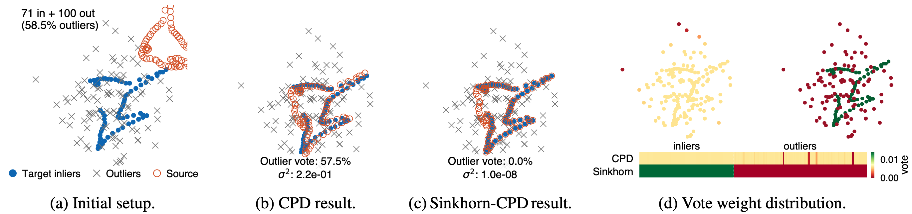

# Sinkhorn-CPD (CAD 2026)

[](https://doi.org/10.1016/j.cad.2026.104104)

Official implementation of the paper:

> **Sinkhorn-CPD: Robust Point Cloud Registration via Unbalanced Entropic Optimal Transport**
>
> Jin Zhang, Mingyang Zhao, Bing Liu, Xin Jiang
>
> *Computer-Aided Design* (VSI: SPM 2026), article no. 104104. [doi:10.1016/j.cad.2026.104104](https://doi.org/10.1016/j.cad.2026.104104)

<p align="center">
  
</p>

## Overview

**CPD's E-step *is* entropic OT — with one marginal dropped:**
$$
\begin{aligned}
\textbf{CPD E-step:}\quad & \min_{P\ge0}\ \langle \mathbf{C},P\rangle + \mathcal{H}(P)
  && \text{s.t.}\ \ \phantom{\Gamma\mathbf{1}=\mathbf{b}\ (\text{source}),\ \ } P^{\!\top}\mathbf{1}=\mathbf{1}\ \ (\text{target only}) \\
\textbf{Entropic OT:}\quad & \min_{\Gamma\ge0}\ \langle \mathbf{C},\Gamma\rangle + \mathcal{H}(\Gamma)
  && \text{s.t.}\ \ \Gamma\mathbf{1}=\mathbf{b}\ (\text{source}),\ \ \Gamma^{\!\top}\mathbf{1}=\mathbf{a}\ \ (\text{target})
\end{aligned}
$$

$$
C_{mn} = \frac{\lVert x_n - T(y_m)\rVert^2}{2\sigma^2} + \frac{D}{2}\log(2\pi\sigma^2)
$$

CPD keeps only the target marginal. **Sinkhorn-CPD relaxes *both* marginals to soft KL penalties**, on the same $\sigma^2$-normalized cost:

$$
\min_{\Gamma\ge0}\ \langle \mathbf{C},\Gamma\rangle + \mathcal{H}(\Gamma)
+ \tau_x\,\mathrm{KL}\!\left(\Gamma^{\!\top}\mathbf{1}\,\Vert\,\mathbf{a}\right)
+ \tau_y\,\mathrm{KL}\!\left(\Gamma\mathbf{1}\,\Vert\,\mathbf{b}\right)
$$

### vs. prior OT-based registration

**RobOT** [1]:

$$
\min_{\Gamma\ge0}\ \big\langle \tfrac12\lVert x_n-T(y_m)\rVert^2,\,\Gamma\big\rangle
+ \varepsilon\,\mathcal{H}(\Gamma)
+ \rho\,\mathrm{KL}(\Gamma\mathbf{1}\,\Vert\,\mathbf{b})
+ \rho\,\mathrm{KL}(\Gamma^{\!\top}\mathbf{1}\,\Vert\,\mathbf{a})
$$

**RPOT** [2]:

$$
\min_{\Gamma\ge0}\ \big\langle \lVert x_n-T(y_m)\rVert^2,\,\Gamma\big\rangle
+ \varepsilon\,\mathcal{H}(\Gamma),
\qquad
\Gamma\mathbf{1}\le\mathbf{b},\ \ \Gamma^{\!\top}\mathbf{1}\le\mathbf{a},\ \ \langle\Gamma,\mathbf{1}\rangle=\beta_m
$$

**Sinkhorn-CPD** (ours):

$$
\min_{\Gamma\ge0}\ \Big\langle \tfrac{\lVert x_n-T(y_m)\rVert^2}{2\sigma^2}+\tfrac{D}{2}\log(2\pi\sigma^2),\,\Gamma\Big\rangle
+ \mathcal{H}(\Gamma)
+ \tau_x\,\mathrm{KL}(\Gamma^{\!\top}\mathbf{1}\,\Vert\,\mathbf{a})
+ \tau_y\,\mathrm{KL}(\Gamma\mathbf{1}\,\Vert\,\mathbf{b})
$$

| Method | Cost $\mathbf{C}$ | Entropy weight | Marginals |
|---|---|:---:|---|
| **RobOT** [1] | $\tfrac12\lVert x-T(y)\rVert^2$ | fixed $\varepsilon$ | dual-KL, fixed $\rho$ |
| **RPOT** [2] | $\lVert x-T(y)\rVert^2$ | decaying, $\varepsilon\!\leftarrow\!0.9\varepsilon$ | hard partial, mass $=\beta_m$ |
| **Sinkhorn-CPD** | $\lVert x-T(y)\rVert^2/2\sigma^2$ | fixed $=1$, adaptive via $\sigma^2$ | dual-KL, fixed $\tau$ |

> [1] Shen et al. *Accurate Point Cloud Registration with Robust Optimal Transport.* NeurIPS 2021, 5373–5389.
> [2] Qin et al. *Rigid Registration of Point Clouds Based on Partial Optimal Transport.* Computer Graphics Forum 41(6):365–378, 2022. [doi:10.1111/cgf.14614](https://doi.org/10.1111/cgf.14614)

**Highlights:**
- **Two-sided outlier robustness** — dual-KL relaxation rejects clutter on source *and* target
- **Self-tuning annealing** — adaptive $\sigma^2$ keeps the OT regularization in scale, no schedules
- **One knob, never retuned** — $\tau=1$ across all noise / outlier / overlap / rotation settings
- **Fast & tiny** — GPU PyTorch, ~100-line core algorithm

## Repository Structure

```
SinkhornCPD/
├── sinkhorn_cpd.py          # Core algorithm
├── metrics.py               # RE, TE, RMSE, Chamfer distance
├── baselines/               # Unified wrappers for 8 baseline methods
│   ├── cpd.py               #   CPD (via probreg)
│   ├── filterreg.py         #   FilterReg (via probreg)
│   ├── fgr.py               #   Fast Global Registration (Open3D)
│   ├── rpot.py              #   RPOT (PyTorch re-implementation)
│   ├── robot.py             #   RobOT (via geomloss)
│   ├── teaser.py            #   TEASER++ (C++ with Python binding)
│   ├── sparseicp.py         #   Sparse-ICP (C++ with Python binding)
│   └── lsgcpd.py            #   LSG-CPD (MATLAB engine)
├── datasets/
│   ├── bunny.ply            # Stanford Bunny source mesh
│   ├── bunny_synth.py       # Bunny loader + perturbation generator
│   ├── synth/               # Pre-generated Bunny benchmark (20 trials per level)
│   └── modelnet/            # ModelNet40 test pairs (download separately)
├── experiments/
│   ├── bunny.py             # Bunny single-factor robustness sweeps
│   └── modelnet.py          # ModelNet40 cross-category evaluation
├── analysis/                # Scripts for aggregating result tables
├── results/                 # Pre-computed CSV results for all methods
│   ├── bunny/{noise,outlier,overlap,rotation}/<Method>.csv
│   └── modelnet/<Method>.csv
├── third_party/             # Vendored baselines (LSG-CPD, RPOT sources)
├── run_all_bunny.sh         # Run all baselines on Bunny
└── run_modelnet_all.sh      # Run all baselines on ModelNet40
```

## Installation

```bash
conda create -n sinkhorn-cpd python=3.10 && conda activate sinkhorn-cpd
pip install -r requirements.txt && pip install -e .
```

Baseline methods load lazily; any with a missing backend is skipped at runtime.

| Baseline | Setup |
|---|---|
| CPD, FilterReg, FGR, RPOT | Bundled via `requirements.txt` |
| RobOT | `pip install geomloss pykeops` |
| Sparse-ICP | Clone [OpenGP/sparseicp](https://github.com/OpenGP/sparseicp) into `third_party/sparseicp/` and CMake-build |
| TEASER++ | Clone [MIT-SPARK/TEASER-plusplus](https://github.com/MIT-SPARK/TEASER-plusplus) into `third_party/TEASER-plusplus/` and CMake-build with Python bindings |
| LSG-CPD | MATLAB >= R2021a + `matlab.engine`; sources vendored at `third_party/LSG-CPD/` |

## Data

**Bunny benchmark** (`datasets/synth/`, ~35 MB) ships with this repo.

**ModelNet40 test pairs** (`datasets/modelnet/data.npz`, 227 MB) are excluded due to GitHub's file size limit. Download from the [GitHub Release](https://github.com/Theigrams/SinkhornCPD/releases/tag/v1.0) and place at `datasets/modelnet/data.npz`:

```bash
# Or download via CLI:
gh release download v1.0 --pattern 'data.npz' --dir datasets/modelnet/
```

See [`datasets/README.md`](datasets/README.md) for data format details and regeneration instructions.

## Usage

### Quick Start

```python
from sinkhorn_cpd import sinkhorn_cpd

R, t, sigma2_history = sinkhorn_cpd(
    source, target,           # (M,3), (N,3) — source @ R.T + t ≈ target
    tau_x=1.0, tau_y=1.0,     # KL marginal weights
    L=20, max_iter=50, tol=1e-5,
)
```

### Run Experiments

```bash
# Stanford Bunny — single-factor robustness sweeps
python -m experiments.bunny --axis noise --method SinkhornCPD
python -m experiments.bunny --axis noise --method all
bash run_all_bunny.sh          # all methods × all axes

# ModelNet40 — 2148 cross-category test pairs
python -m experiments.modelnet --method SinkhornCPD
bash run_modelnet_all.sh       # all methods

# Aggregate result tables
python -m analysis.bunny_full_table    # → results/bunny_full_table.txt
python -m analysis.modelnet_summary    # → results/modelnet_summary.txt
```

Per-pair logs are saved to `results/{bunny/<axis>,modelnet}/<Method>.csv` with columns: `rre` (deg), `rte`, `rmse`, `time` (s).

## Results

Pre-computed results are in `results/`. Below are key tables from the paper.

### Bunny — Mean RE (°), 20 trials per level

<details>
<summary><b>Noise</b> (σ = 0.01 – 0.05)</summary>

| σ | TEASER++ | FGR | Sparse-ICP | CPD | FilterReg | LSG-CPD | RPOT | RobOT | Ours(0.1) | Ours(1.0) |
|---|---|---|---|---|---|---|---|---|---|---|
| 0.01 | 0.92 | 1.76 | 28.22 | 0.09 | 0.07 | 12.80 | 0.09 | 5.82 | 0.07 | **0.06** |
| 0.02 | 1.66 | 13.00 | 27.93 | 0.33 | 0.27 | 7.63 | 0.57 | 5.89 | 0.21 | **0.20** |
| 0.03 | 3.57 | 80.86 | 27.62 | 0.56 | 0.63 | 7.57 | 1.09 | 5.99 | **0.35** | 0.37 |
| 0.04 | 9.89 | 42.84 | 27.36 | 0.82 | 1.07 | 10.15 | 1.71 | 6.12 | **0.51** | 0.56 |
| 0.05 | 47.24 | 32.48 | 27.54 | 1.14 | 1.49 | 10.90 | 3.20 | 6.27 | **0.71** | 0.78 |

</details>

<details>
<summary><b>Outlier</b> (r = 0.1 – 0.7)</summary>

| r | TEASER++ | FGR | Sparse-ICP | CPD | FilterReg | LSG-CPD | RPOT | RobOT | Ours(0.1) | Ours(1.0) |
|---|---|---|---|---|---|---|---|---|---|---|
| 0.1 | 1.33 | 10.54 | 28.54 | **0.15** | 0.28 | 7.94 | 0.49 | 4.85 | 0.19 | 0.18 |
| 0.2 | 1.62 | 15.59 | 27.93 | 0.33 | 0.27 | 7.63 | 0.57 | 5.89 | 0.21 | **0.20** |
| 0.3 | 1.79 | 25.10 | 29.92 | 12.10 | 0.29 | 6.30 | 0.62 | 6.89 | 0.23 | **0.22** |
| 0.4 | 3.18 | 36.34 | 28.71 | 14.08 | 0.34 | 5.20 | 1.02 | 7.70 | 0.26 | **0.22** |
| 0.5 | 4.03 | 44.86 | 29.27 | 15.03 | 0.46 | 5.38 | 1.40 | 8.82 | 0.26 | **0.25** |
| 0.6 | 14.31 | 72.80 | 27.99 | 20.15 | 0.55 | 5.34 | 2.58 | 12.95 | **0.28** | **0.28** |
| 0.7 | 27.06 | 66.48 | 28.52 | 23.46 | 0.58 | 3.80 | 3.22 | 14.76 | **0.40** | 0.47 |

</details>

<details>
<summary><b>Overlap</b> (o = 0.4 – 0.9)</summary>

| o | TEASER++ | FGR | Sparse-ICP | CPD | FilterReg | LSG-CPD | RPOT | RobOT | Ours(0.1) | Ours(1.0) |
|---|---|---|---|---|---|---|---|---|---|---|
| 0.4 | **5.16** | 40.82 | 31.48 | 32.51 | 57.84 | 12.80 | 25.90 | 39.28 | 11.66 | 31.51 |
| 0.5 | **3.14** | 30.69 | 29.96 | 25.00 | 40.70 | 9.64 | 13.39 | 36.84 | 5.47 | 9.23 |
| 0.6 | 2.22 | 26.25 | 28.67 | 14.73 | 25.40 | 8.74 | 6.25 | 24.47 | **0.84** | 1.09 |
| 0.7 | 2.14 | 15.10 | 28.89 | 7.35 | 7.95 | 8.59 | 2.99 | 16.40 | 0.30 | **0.28** |
| 0.8 | 1.59 | 12.51 | 29.81 | 2.07 | 0.52 | 7.91 | 1.21 | 9.94 | 0.23 | **0.20** |
| 0.9 | 1.65 | 13.08 | 27.93 | 0.33 | 0.27 | 7.63 | 0.57 | 5.89 | 0.21 | **0.20** |

</details>

<details>
<summary><b>Rotation</b> (θ = 10° – 90°)</summary>

| θ° | TEASER++ | FGR | Sparse-ICP | CPD | FilterReg | LSG-CPD | RPOT | RobOT | Ours(0.1) | Ours(1.0) |
|---|---|---|---|---|---|---|---|---|---|---|
| 10 | 0.93 | 9.05 | 13.27 | 0.29 | 0.31 | 0.40 | 0.52 | 5.84 | 0.21 | **0.20** |
| 20 | 1.46 | 10.94 | 21.39 | 0.30 | 0.28 | 1.63 | 0.52 | 5.87 | 0.21 | **0.20** |
| 30 | 1.72 | 12.93 | 27.93 | 0.33 | 0.26 | 7.63 | 0.57 | 5.89 | 0.21 | **0.20** |
| 40 | 1.88 | 18.07 | 36.01 | 0.37 | 0.32 | 16.42 | 4.92 | 5.91 | 0.21 | **0.20** |
| 50 | 2.51 | 20.65 | 46.83 | 0.45 | 0.28 | 29.55 | 24.60 | 5.94 | 0.22 | **0.20** |
| 60 | 2.26 | 16.68 | 59.60 | 0.61 | 0.32 | 39.98 | 39.79 | 5.99 | 0.33 | **0.20** |
| 70 | 10.77 | 30.58 | 71.04 | 0.96 | 4.19 | 52.62 | 55.79 | 6.12 | 1.06 | **0.24** |
| 80 | 21.33 | 31.00 | 80.14 | 1.92 | 18.90 | 67.01 | 70.85 | 6.56 | 6.70 | **0.75** |
| 90 | **22.46** | 47.67 | 89.29 | 26.56 | 29.94 | 83.90 | 85.98 | 41.32 | 52.24 | 37.68 |

</details>

### ModelNet40 — 2148 cross-category test pairs

| Method | RE (°) | TE (×10³) | RMSE (×10³) | RR (%) | Time (s) |
|---|---|---|---|---|---|
| TEASER++ | 3.70 | 23.3 | 21.7 | 60.6 | **0.07** |
| FGR | 5.58 | 44.7 | 45.7 | 18.0 | 0.08 |
| Sparse-ICP | 18.58 | 253.2 | 268.3 | 1.0 | 0.11 |
| CPD | 1.73 | 28.6 | 30.0 | 59.9 | 3.03 |
| FilterReg | 1.29 | 16.4 | 16.6 | 85.5 | 0.12 |
| LSG-CPD | 8.14 | 134.8 | 147.2 | 28.8 | 0.15 |
| RPOT | 2.81 | 33.7 | 40.1 | 71.6 | 1.03 |
| RobOT | 5.67 | 87.4 | 93.4 | 5.9 | 0.53 |
| **Sinkhorn-CPD** | **0.64** | **13.5** | **14.3** | **88.9** | 0.53 |

## Citation

```bibtex
@article{zhang2026sinkhorncpd,
  title     = {Sinkhorn-CPD: Robust Point Cloud Registration via Unbalanced Entropic Optimal Transport},
  author    = {Zhang, Jin and Zhao, Mingyang and Liu, Bing and Jiang, Xin},
  journal   = {Computer-Aided Design},
  pages     = {104104},
  year      = {2026},
  publisher = {Elsevier},
  doi       = {10.1016/j.cad.2026.104104},
}
```

## License

This project is licensed under the MIT License. See [LICENSE](LICENSE) for details.
